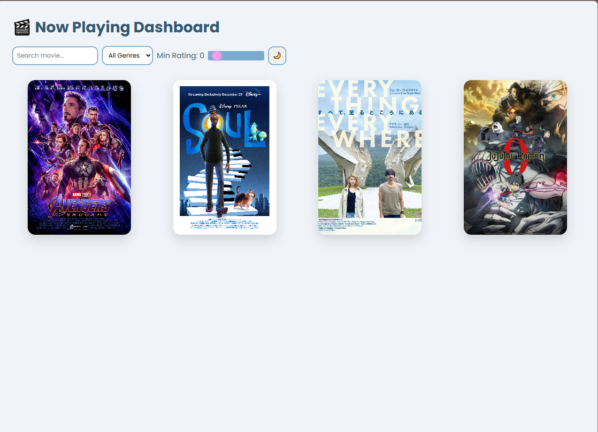

# 🎬 Movie Dashboard

A modern **movie dashboard web application** that displays films currently playing in theaters.

This project provides an interactive interface to explore movies using **search, genre filters, and rating filters** in a clean dashboard-style layout.

---

## 🚀 Features

* 🔍 **Search Movies** – quickly find movies by title
* 🎭 **Genre Filter** – filter movies by genre
* ⭐ **Minimum Rating Filter** – adjust rating using a slider
* 🌙 **Dark Mode Toggle** – switch between light and dark themes
* 🎬 **Movie Poster Grid** – visually appealing layout for movie posters

---

## 🧠 Tech Stack

This project was built using:

* **HTML5**
* **CSS3**
* **JavaScript**
* **GitHub Pages** (deployment)

---

## 📸 Preview

<p align="center">

</p>

---

## ⚡ Live Demo

You can view the live website here:

👉 https://agusadhitama.github.io/movie-dashboard/

---

## 📂 Project Structure

```
movie-dashboard/
│
├── index.html
├── style.css
├── script.js
├── images/
│   └── preview.png
└── assets/
```

---

## 🎯 Purpose of the Project

This project was created to practice and demonstrate:

* Frontend UI development
* Interactive dashboard layouts
* Filtering and search functionality
* Responsive web design

---

## 👨‍💻 Author

**Agus Satria Adhitama**

IT Support • Web Developer • System & Network Enthusiast

GitHub
https://github.com/agusadhitama

---

⭐ If you like this project, feel free to give it a star!
